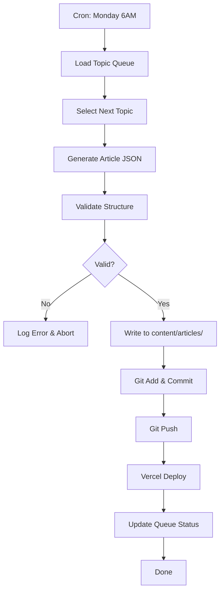

# TradeGo Zimbabwe Content Cron System

## Overview

This system automatically generates SEO articles for the Zimbabwe & Beira Port market every week.

## Setup

```bash
# Install cron job (runs every Monday at 6:00 AM)
./setup-content-cron.sh --install

# Check status
./setup-content-cron.sh --status

# Test run (dry-run)
./setup-content-cron.sh --test
```

## Manual Commands

```bash
# List all topics in the queue
node gen-zimbabwe-content.js --list

# Show next topic to be generated
node gen-zimbabwe-content.js --next

# Generate next topic (dry-run)
node gen-zimbabwe-content.js --dry-run

# Generate and deploy next topic
node gen-zimbabwe-content.js --deploy

# Generate specific topic by ID
node gen-zimbabwe-content.js --topic=zimbabwe-mining-specific
```

## Cron Schedule

**Every Monday at 6:00 AM (Asia/Shanghai timezone)**

```
0 6 * * 1
```

## Content Queue

The topic queue is stored in `content-queue.json`. Topics are organized by:
- Priority (P0, P1, P2)
- Scheduled week
- Target countries (Zimbabwe, Zambia, Malawi, DRC)
- Content template type

## Article Templates

The system supports multiple content templates:
- `technical-guide` - Technical specifications and requirements
- `logistics-guide` - Shipping, customs, and logistics information
- `regional-supplier` - Regional market guides
- `reference-guide` - Standards and comparison tables
- `practical-guide` - How-to and practical solutions
- `application-guide` - Application-specific guides
- `case-study` - Success stories and ROI analysis
- `quarterly-update` - Market updates and trends

## Content Pipeline

1. **Cron triggers** → Every Monday at 6:00 AM
2. **Select topic** → Highest priority pending topic
3. **Generate article** → Based on template and topic data
4. **Validate structure** → Ensures article format is correct
5. **Commit to git** → Auto-commits with descriptive message
6. **Deploy to Vercel** → Automatically deploys to production
7. **Update queue** → Marks topic as completed

## Topic Queue Structure

```json
{
  "topics": [
    {
      "id": "topic-id",
      "title_en": "English Title",
      "title_zh": "中文标题",
      "priority": "P0",
      "status": "pending|draft|done",
      "scheduledWeek": 1,
      "template": "technical-guide",
      "targetCountries": ["Zimbabwe", "Zambia"],
      "targetAudience": "Mining engineers",
      "searchIntent": "informational",
      "estimatedTraffic": "high|medium|low"
    }
  ]
}
```

## Monitoring

Check logs at: `logs/content-cron.log`

## Workflow



## Customization

To modify the content templates or generation logic, edit `gen-zimbabwe-content.js`.

To modify the topic queue, edit `content-queue.json`.
